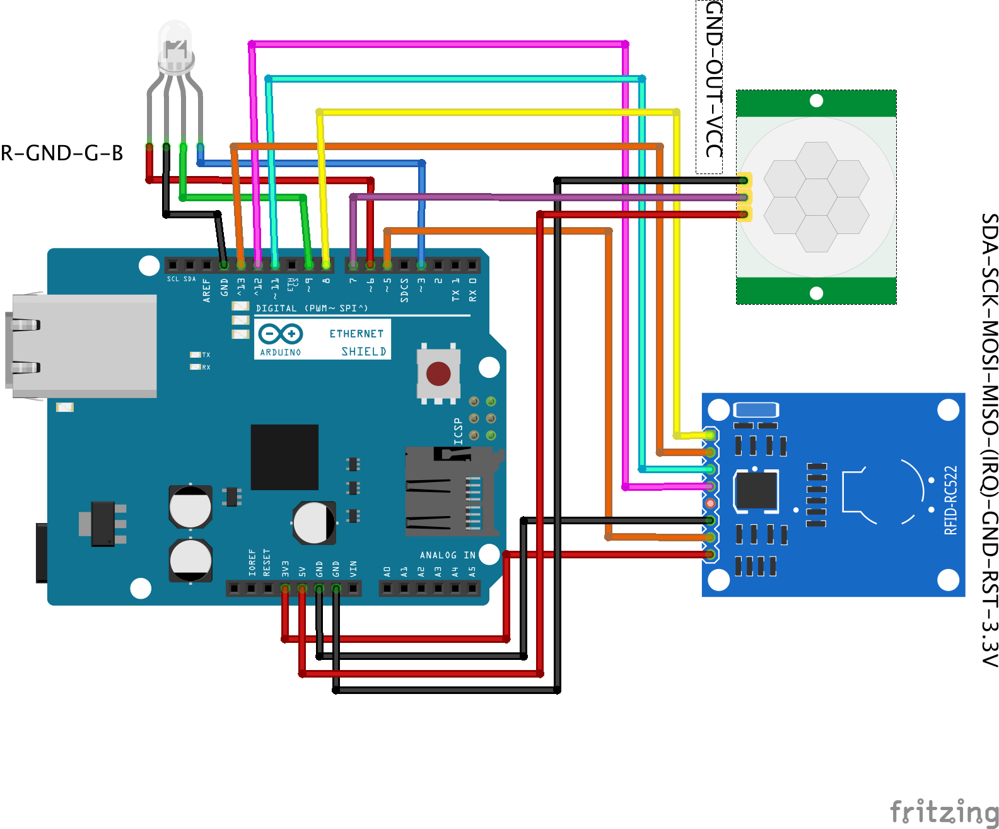

# Ardularm

Ardularm is a proof-of-concept project which focuses on making an inexpensive alarm based on the Arduino platform.

## Components and Wiring

Scheme:

You can also view this scheme in the Fritzing programme (`Ardularm (wiring).fzz`).

Used components:
* Arduino UNO Rev3
* Ethernet Shield R3
* RFID Reader RC522
* Passive Infrared Sensor HC-SR501 
* Generic RGB Diode

(Other components might work as well - not tested.)

## Installation

Ardularm had been developed with Arduino IDE (for the Arduino code) and any other editor (for the server-side PHP code). Libraries [AddicoreRFID](http://www.addicore.com/v/vspfiles/downloadables/Product%20Downloadables/RFID_RC522/AddicoreRFID.zip)* and [Bootstrap framework](http://getbootstrap.com/) were used while creating this. To run this project on your own, there are a few steps necessary:

1. Fill in the settings file with the right credentials for your database in `Server\config.template.php` and save it as `Server\config.php`.
2. Create a `Server\.htpasswd` file with your desired user name and password (https://faq.oit.gatech.edu/content/how-do-i-do-basicauth-using-htaccess-and-htpasswd).
3. Upload the content of `Server` onto your server.
4. Run the `Server\create.php` script. This will create all the tables needed for the project and necessary values.
5. Wire up your Arduino UNO according to "Components and Wiring" section of this document.
6. Fill in the variables in `Arduino\Ardularm\Ardularm.ino` under the comment "user-configurable".
7. Upload `Arduino\Ardularm\Ardularm.ino` on your Arduino UNO using the Arduino IDE.
8. Repeat steps 5, 6, 7 for each unit you want to connect.
9. Enjoy your extra safety.

\* The AddicoreRFID library had to be edited in order to work with Ethernet shield.

## How to use Ardularm?

**Turn alarm on/off**   
Trusted card has to be used to toggle the state. When the alarm is on the diode turns red, when off it is green (as a traffic light - green means you can enter).

**Add/remove a card to/from trusted**   
First, MasterTag has to be detected and the diode turns blue. Then you can scan your card and it will be added as trusted, if it was not trusted befor. BEWARE: If your card already is trusted, it will be REMOVED.

**Viewing the log**   
Log is located on the page `../dash.php`.

**Editing card name**
Under the date selection on the log page, click the button "Change User Name".

## Possible Extensions

Code posted here can be further developed. Possible extensions include:
* Modify code to work on other Arduino boards (pins must be changed according to the unit in `Arduino.ino`)
* Buzzer extension (edit `Arduino.ino`)
* WiFi extension (edit `Arduino.ino`)

## License

[MIT](https://github.com/MichalMares/Ardularm/blob/master/LICENSE.txt) @ [Michal Mareš](https://github.com/MichalMares)
