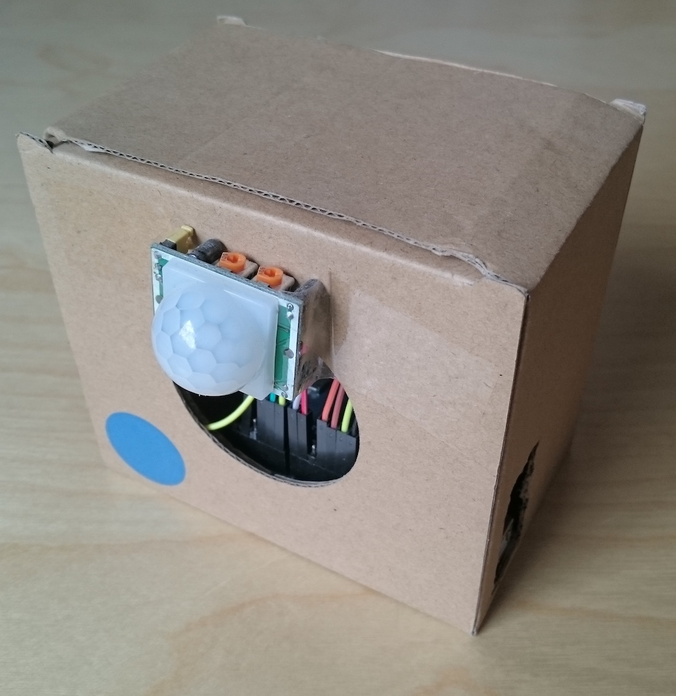
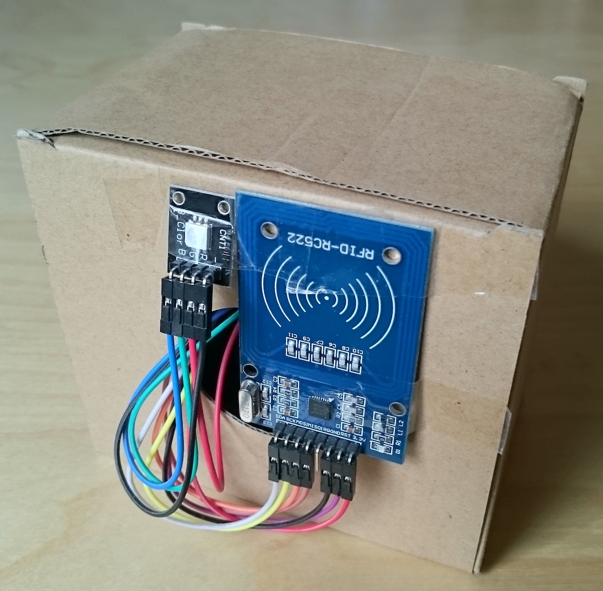
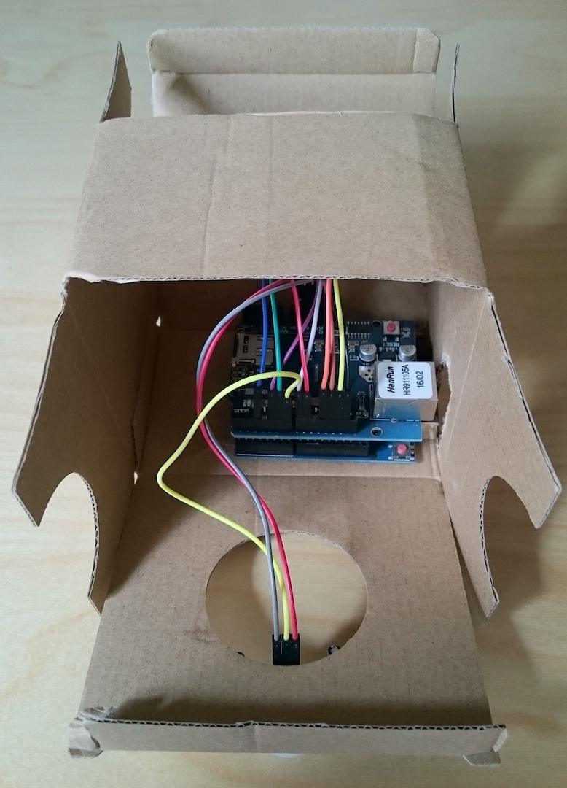

# Ardularm

Ardularm is a proof-of-concept project which focuses on making an inexpensive alarm based on the Arduino platform.   
[GitHub Repository](https://github.com/MichalMares/Ardularm)

## Components and Wiring

Scheme:

You can also view this scheme in the Fritzing programme (`Wiring.fzz`).

Used components:
* Arduino UNO Rev3
* Ethernet Shield R3
* RFID Reader RC522
* Passive Infrared Sensor HC-SR501 
* Generic RGB Diode

Other components might work as well (not tested).

## Installation

Ardularm had been developed with Arduino IDE (for the Arduino code) and any other editor (for the server-side PHP code). Libraries [AddicoreRFID](http://www.addicore.com/v/vspfiles/downloadables/Product%20Downloadables/RFID_RC522/AddicoreRFID.zip)* and [Bootstrap framework](http://getbootstrap.com/) were used while creating this. To run this project on your own, there are a few steps necessary:

1. Create a database and an e-mail box on your hosting.
2. Fill in the settings file with the right credentials for your database in `Server\template.config.php` and save it as `Server\config.php`.
3. Create a `Server\.htpasswd` file with your desired user name and password (https://faq.oit.gatech.edu/content/how-do-i-do-basicauth-using-htaccess-and-htpasswd), edit path in `Server\template.htaccess` file and save it as `.htaccess`. ".htaccess" works for Apache servers only!
4. Upload the content of `Server` onto your server.
5. Run the `Server\create.php` script. This will create all the tables needed for the project and necessary values.
6. Wire up your Arduino UNO according to "Components and Wiring" section of this document.
7. Fill in the variables in `Arduino\Ardularm\Ardularm.ino` under the comment "user-configurable".
8. Upload `Arduino\Ardularm\Ardularm.ino` on your Arduino UNO using the Arduino IDE.
9. Repeat steps 6, 7, 8 for each unit you want to connect.
10. Enjoy your extra safety.

Ardularm had been developed running an Apache server with MySQL database. However, PDO should ensure it works on other SQL databases as well (not tested).

Arduino's (`Ardularm.ino`) and server's (`config.php`) "key" must correspond and can not be empty. It ensures that the POST requests come directly from the Arduino unit. If you use multiple Arduinos, "key" has to be the same for all of them.

\* The AddicoreRFID library had to be edited in order to work with Ethernet shield.

## How to use Ardularm?

**Turn alarm on/off**   
Trusted card has to be used to toggle the state. When the alarm is on the diode turns red, when off it is green (as a traffic light - green means you can enter).

**Add/remove a card to/from trusted**   
First, MasterTag has to be detected and the diode turns blue. Then you can scan your card and it will be added as trusted, if it was not trusted befor. BEWARE: If your card already is trusted, it will be REMOVED.

**Viewing the log**   
Log is located on the page `../dash.php`. Entries are sorted from newest to oldest. To search in between specific dates, enter them and click "search". If you want to leave the page running and see new entries without refreshing the page, just tick the "autorefresh" checkbox. This will refresh the page atomatically every 5 seconds.

**Editing card name**
Under the date selection on the log page, click the button "Change User Name". All four IDs must be filled in order to change the name. Successful change will be confirmed at the end of the paragraph.

## Result

When done correctly, final product should look something like this:

The PIR sensor should face the area you want to secure and RFID reader with LED should be accessable without entering it. Of course, wires can be lengthened and mechanically protected in order to achieve this result.

## For Developers

Ardularm consists of three main parts.   
The first one is the code for Arduino unit (`Arduino\Ardularm\Ardularm.ino`), which works just like any other Arduino sketch - there is a setup() method which runs once and loop() method, which cycles for the rest of the time, running the code and calling the other methods.   
Second are the API's, which take care of the communication between Arduino and the database (`Server\api\`).   
Last is the dashboard (`Server\dash.php`) which shows the log to the user and enables some basic sorting and changing the name of the cards (`Server\user.php`).

In-depth documentation can be found in `Server\DoxyDoc\`.

Code posted here can be further developed.   
If you would like to make it work on a different Arduino board, change pin definitions at the beginning of `Arduino\Ardularm\Arduino.ino`. Mainly, SPI pins (which are pre-defined) must be changed and then connected accordingly.   
Buzzer extension is also possible: add a tone(pin, frequency) method into the `if (digitalRead(pirPin) == HIGH)` block of code and noTone() after it. [Documentation of tone()](https://www.arduino.cc/en/reference/tone)   
To send a SMS alert instead of an email, you will need something like a GSM/GPRS Shield. Instead of calling `post("sendMail", "");` in `if (digitalRead(pirPin) == HIGH)` block, you will then use sms.print() method to send a SMS according to the [official tutorial](https://www.arduino.cc/en/Tutorial/GSMExamplesSendSMS) on sending SMS.

## License

[MIT](https://github.com/MichalMares/Ardularm/blob/master/LICENSE.txt) @ [Michal Mareš](https://github.com/MichalMares)
