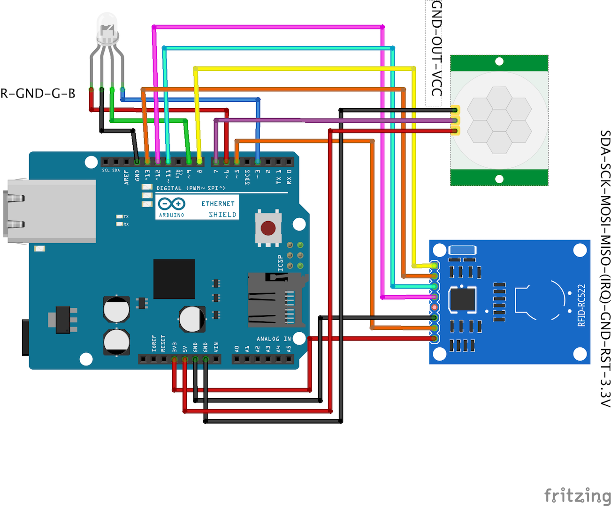
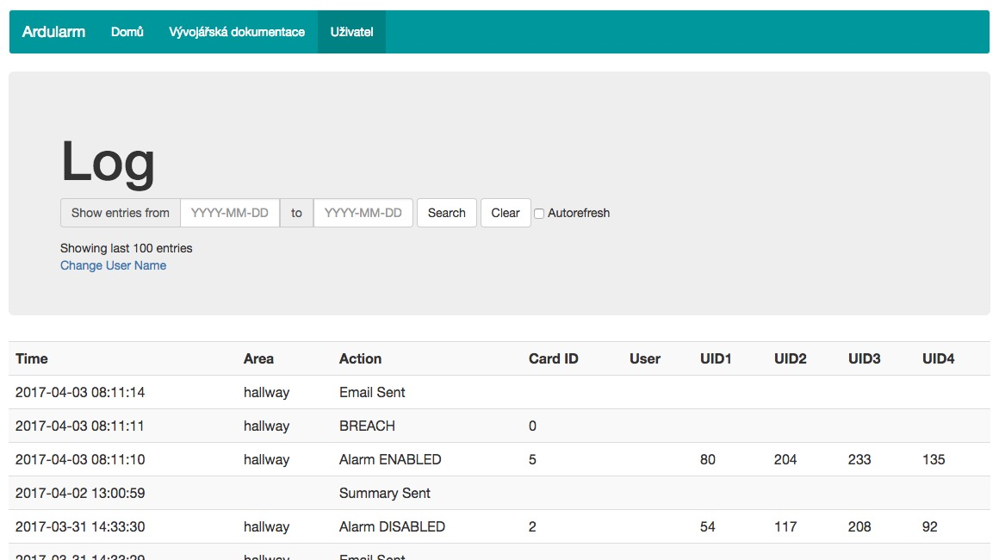
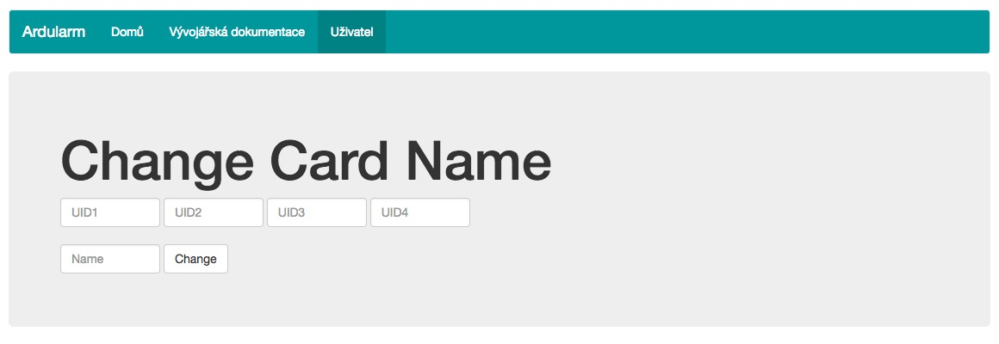
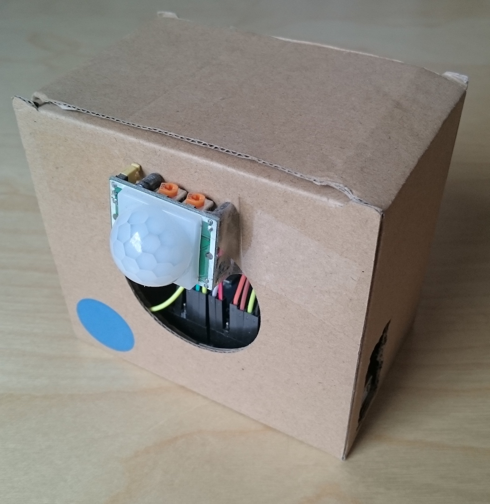
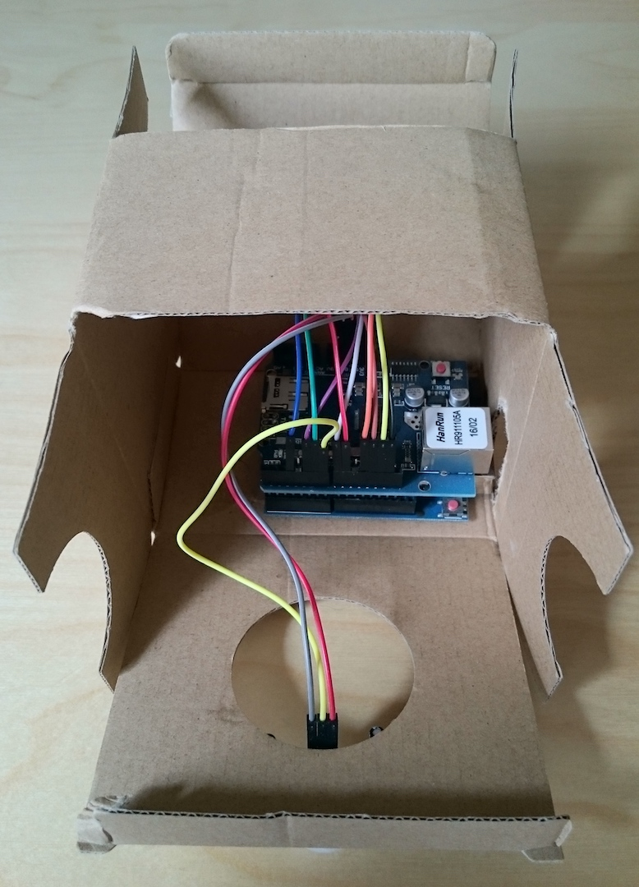

# Ardularm

Ardularm je projekt, který se zabývá vytvořením levného domácího alarmu prostřednictvím platformy Arduino.

## Komponenty a zapojení

Schéma zapojení:

Použité součástky:
* Arduino UNO Rev3
* Ethernet Shield R3
* RFID Reader RC522
* Passive Infrared Sensor HC-SR501 
* Generic RGB Diode

Jiné součástky mohou také fungovat (netestováno.)

## Instalace

Ardularm byl vytvořen pomocí Arduino IDE (kód pro Arduino) a dalším editorem (pro serverovou část, PHP kód). Knihovny [AddicoreRFID](http://www.addicore.com/v/vspfiles/downloadables/Product%20Downloadables/RFID_RC522/AddicoreRFID.zip)* a [Bootstrap framework](http://getbootstrap.com/) byly využity při vývoji. Pro instalaci projektu je potřeba:

1. Vytvořte databázi a e-mailovou schránku na vašem hostingu.
2. Upravte a vyplňte `Server\config.template.php` a uložte soubor jako `Server\config.php`.
3. Vytvořte soubor `Server\.htpasswd` se zvoleným uživatelským jménem a heslem (https://faq.oit.gatech.edu/content/how-do-i-do-basicauth-using-htaccess-and-htpasswd). Zabezpečení přes htaccess platí pouze pro servery Apache!
4. Nahrajte obsah adresáře `Server` na server.
5. Spusťte `Server\create.php`. Tím automaticky vytvoříte tabulky databáze potřebné pro fungování Ardularmu.
6. Zapojte vaše Arduino UNO podle sekce "Komponenty a zapojení".
7. Vyplňte proměnné v `Arduino\Ardularm\Ardularm.ino` pod komentářem "user-configurable".
8. Nahrajte `Arduino\Ardularm\Ardularm.ino` na vaše Arduino UNO prostřednictvím Arduino IDE.
9. Opakujte kroky 6, 7, 8 pro každé zařízení, které si přejete připojit.
10. Užívejte si pocit bezpečí.

Ardularm byl vyvinut na Apache serveru s MySQL databází, nicméně PDO by mělo zajistit kompatibilitu s ostatními SQL databázemi (netestováno).

Klíč "key" Arduina (`Ardularm.ino`) musí souhlasit s klíčem severu (`config.php`) a nemůže být prázdný. Zajišťuje, že komunikace POST requestem pochází přímo z Arduina. Při použití více Arduin musí být klíče na všech stejné.

\* Knihovna AddicoreRFID musela být modifikována, aby fungovala paralelně s Ethernet Shield.

## Návod k použití

**Zapnutí/vypnutí alarmu**   
Pouze důvěryhodné karty mohou přepínat stav alarmu. Pokud je alarm aktivní, svítí červeně, pokud neaktivní, zeleně (jako semafor - zelená znamená, že můžete projít).

**Přidat/odebrat kartu do/z důvěryhodných**   
Nejdříve je potřeba načíst MasterTag (administrátorská karta) a vyčkat, než se dioda rozsvítí modře. Pak lze načíst další kartu, která bude zaevidována jako důvěryhodná, pokud předtím nebyla. POZOR: Pokud karta již byla důvěryhodná, bude z důvěryhodných ODEBRÁNA.

**Zobrazení událostí**   
Zobrazení událostí je možné v logu na `../dash.php`. Záznamy jsou seřazeny od nejnovějšího po nejstarší. Pro vyhledání v určitém časovém období, vyplňte data a stiskněte tlačítko "search". Pokud chcete stránku nechat spuštěnou a vidět nové záznamy, zatrhněte "atorefresh". Stránka se pak bude obnovovat s frekvencí 5 sekund.

**Změna jména karty**
Pod výběrem data u logu klikněte na "Change User Name". Všechny čtyři identifikační čísla musí být vyplněny, aby mohlo být změněno jméno. Úspěšná změna bude potvrzena oznámením na konci odstavce.

## Výsledek

Při správném postupu by měl konečný výtvor vypadat podobně:

Infračervený sensor by měl směřovat do prostoru, který si přejete zajistit, RFID čtečka spolu s LED by pak měla být přístupná bez narušení tohoto prostoru. Vodiče mohou být samozřejmě prodlouženy a mechanicky chráněny pro dosažení takového výsledku.

## Licence

[MIT](https://github.com/MichalMares/Ardularm/blob/master/LICENSE.txt) @ [Michal Mareš](https://github.com/MichalMares)
